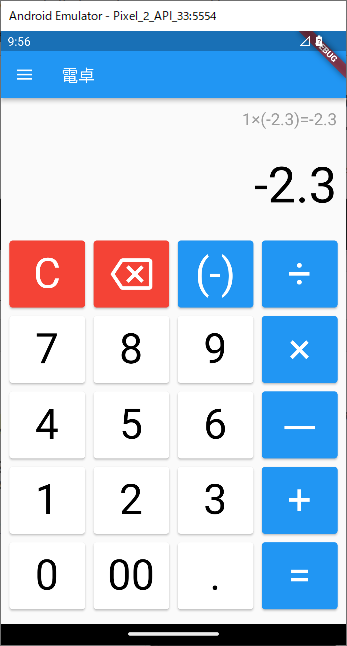
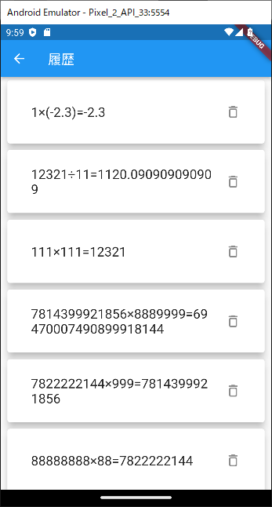
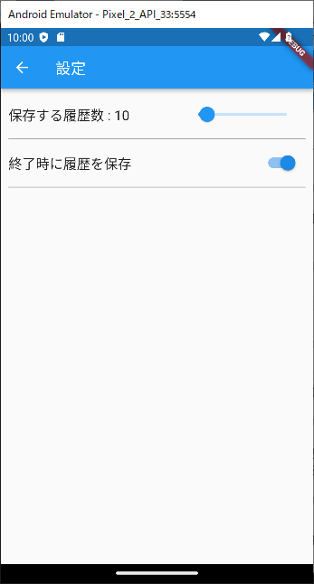

# 電卓アプリ
Flutterで作成した電卓アプリです。  
AndroidやiOS上などで動作します。    

モバイルプログラミングの授業の最終課題として作成しました。

## 主な機能

- 一般的な四則演算
- 小数点や負の数の利用
- 最大100件の履歴保持

## 利用方法

リポジトリをクローン後、`flutter run`を実行してください。

## 開発環境

- Flutter 3.3.10
- Dart 2.18.6
- DevTools 2.15.0
- Android Studio 2021.3
- Visual Studio Code 1.74.3

## 動作確認環境

- Google Pixel 2 Android 13 Emulator
- Google Pixel 6 Android 13 Emulator

## スクリーンショット

